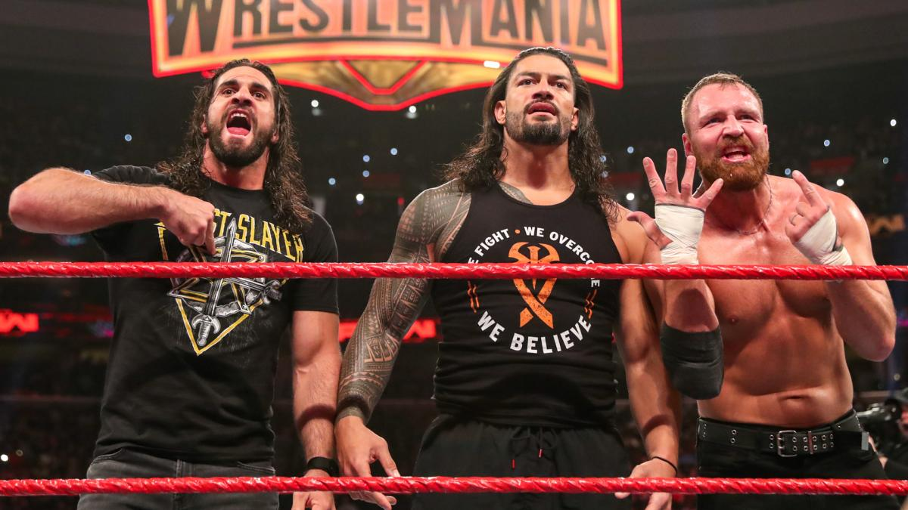

# Raw 1345期

> 日期：2019.03.04
>
> 地点：费城，富国银行中心

### 本期看点

- Roman Reigns 对话 Seth Rollins 希望可以与 Dean Ambrose 重组 The Shield，Dean Ambrose 在发表想法之前被 Elias 偷袭；
- Triple H 喊话 Batista，但后者并没有现身；
- Baron Corbin、Bobby Lashley、Drew McIntyre 攻击 Roman Reigns & Seth Rollins，Dean Ambrose 救场，The Shiled 重组；
- Michael Che & Colin 与 Braun Strowman 发生冲突；
- Becky Lynch 解禁，将与 Charlotte Flair 在 Fastlane 上打一场比赛，如果 Becky 获胜，她将加入到 WrestleMania 争夺 Raw女子冠军；
- Stephanie McMahon 拒绝将冠军腰带还给 Randa Rousey，Randa恼羞成怒，疯狂攻击 Becky Lynch，Charlotte Flair 逃走。

### 本期赛果

- Drew McIntyre, Bobby Lashley & Baron Corbin 战胜洲际冠军 Finn Bálor, Braun Strowman & Kurt Angle
- Natalya 战胜 Ruby Riott
- Heavy Machinery 在一场车轮战中战胜 The B-Team, The Ascension , Zack Ryder & Curt Hawkins
- Elias 战胜 Dean Ambrose
- Tamina 战胜 Sasha Banks
- Raw 双打冠军 The Revival 凭借对手场外违规被取消资格战胜 Aleister Black & Ricochet