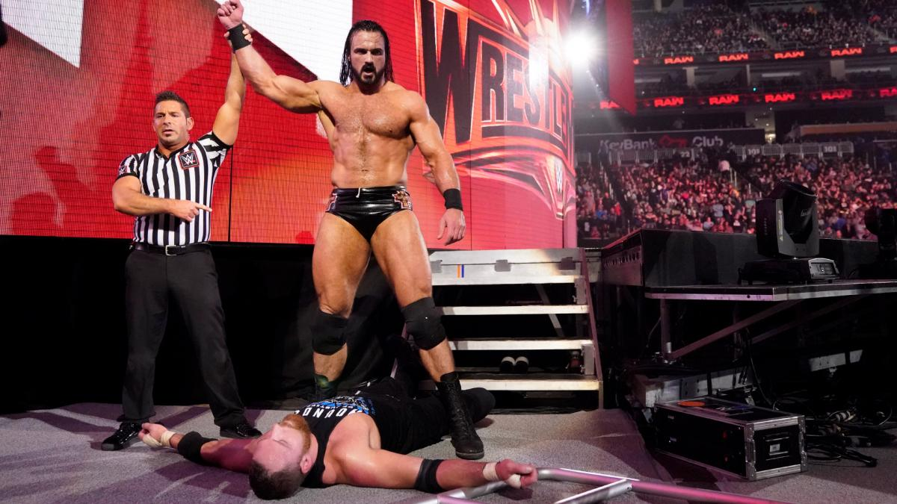

# Raw 1346期

> 日期：2019.03.11
>
> 地点：匹兹堡，PPG涂料竞技场

### 本期看点

- The Shield 发表告别演说，Shelton Benjamin 袭击 Seth Rollins；
- Dana Brooke 对峙 Raw女子冠军 Ronda Rousey；
- Alexa Bliss 宣布自己将作为 WrestleMania 35 的主持人；
- Braun Strowman 把 Colin Jost 送给他的跑车拆了；
- Triple H 对峙 Batista，二人同意在 WrestleMania 35 上进行一场无规则比赛；
- Kurt Angle 透露自己的退役日期；
- Drew McIntyre 重创 Roman Reigns，Dean Ambrose 要求迎战 Drew McIntyre。

### 本期赛果

- Seth Rollins 战胜 Shelton Benjamin
- Bobby Lashley 战胜 Finn Bálor 成为新科洲际冠军
- Aleister Black & Ricochet 战胜 Bobby Roode & Chad Gable
- Nia Jax 战胜 Natalya
- Kurt Angle 战胜 Apollo Crews
- Drew McIntyre 战胜 Dean Ambrose