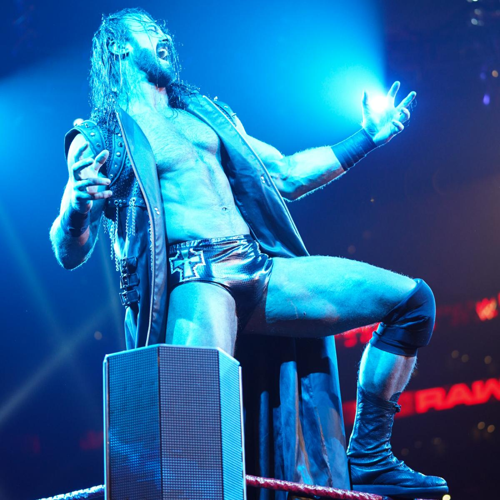

# Raw 1348期

> 日期：2019.03.25
>
> 地点：波士顿，北岸花园球馆

### 本期看点

- Roman Reigns 接受 Drew McIntyre 在 WrestleMania 上的挑战；
- Alexa Bliss 将《周六夜现场》节目的 Colin Jost & Michael Che 加入 Andre the Giant 纪念战；
- Paul Heyman 对峙 Seth Rollins；
- Triple H 同意与 Batista 在 WrestleMania 的比赛赌上自己的职业生涯；

### 本期赛果

- Becky Lynch 战胜 Raw女子冠军 Ronda Rousey & Charlotte Flair（时间挑战赛）
- Finn Bálor 战胜 洲际冠军 Bobby Lashley & Jinder Mahal
- Aleister Black & Ricochet 战胜 Raw双打冠军 The Revival
- Sasha Banks 战胜 Natalya
- Baron Corbin 战胜 Apollo Crews
- Kurt Angle 战胜 美国冠军 Samoa Joe
- Drew McIntyre 战胜 Dean Ambrose （最后站立者比赛）
