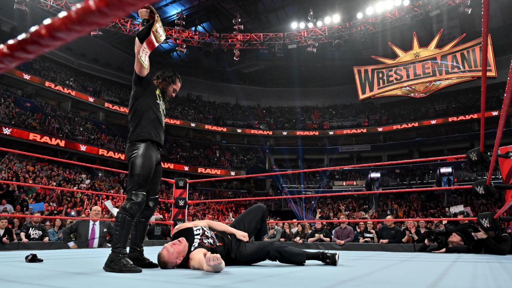

# Raw 1348期

> 日期：2019.04.01
>
> 地点：华盛顿，首府竞技场

### 本期看点

- Stephanie McMahon 宣布 WrestleMania 主赛的新规则；
- Seth Rollins 对峙 环球冠军Brock Lesnar；
- Batista 发表对 Triple H 最后的讲话；
- Drew McIntyre 在后台袭击 Roman Reigns；
- Raw女子冠军 Ronda Rousey, SmackDown女子冠军 Charlotte Flair & Becky Lynch 全部被捕；
- “The Demon” Finn Bálor 对峙 洲际冠军Bobby Lashley；

### 本期赛果

- The Boss ‘N’ Hug Connection, Beth Phoenix & Natalya 战胜 Nia Jax, Tamina & The IIconics
- Apollo Crews 战胜 Jinder Mahal
- The Revival 战胜 Aleister Black & Ricochet
- Heavy Machinery 战胜 Bobby Roode & Chad Gable
- Braun Strowman 战胜 “Colin Jost” & “Michael Che”
- Baron Corbin 战胜 Rey Mysterio
